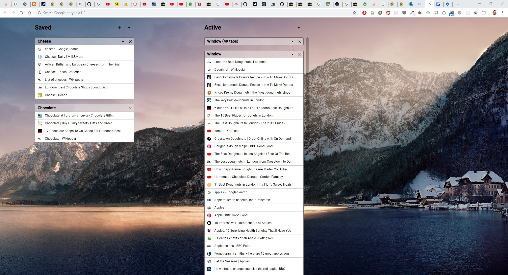

# Chrome Tab Manager

Chrome tab manager is a chrome extension which replaces the newtab page with a UI to enable fast switching between windows and tabs.

* Save and restore windows
* Group tabs by category
* Share tabs across devices

## Development server

Run `ng serve` for a dev server.

## Build

Run `ng build` to build the project. The build artifacts will be stored in the `dist/` directory. Use the `--prod` flag for a production build.

## Running unit tests

Run `ng test` to execute the unit tests via [Karma](https://karma-runner.github.io).

## Running end-to-end tests

Run `ng e2e` to execute the end-to-end tests via [Protractor](http://www.protractortest.org/).
